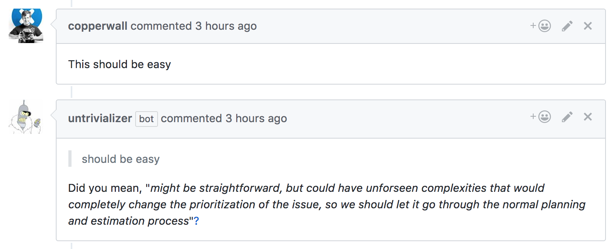

# untrivializer

> a GitHub App built with [probot](https://github.com/probot/probot) that asks in Github comments if you're really sure something is trivial.



## But why tho

A lot of times we'll write up an issue without really thinking it through:

> We want _X_. Just do thing _Y_ to get it, that should be really simple.

> Make change _Z_, it should be trivial.

> Do thing _Foo_, it's super easy.

Doing those things (almost without fail) takes way, way more time than we think it will. Why? A couple reasons: 

* If we're making a comment like that we're probably not thinking through all the little details anyway,
* We're all just [terrible at estimating, _even when we know we're terrible at estimating_](https://en.wikipedia.org/wiki/Planning_fallacy) (it's truly incredible),
* We often forget the downstream repercussions of "simple" changes -- one line of code for you might mean 3 hours or more of code review, testing, etc.

So this little robot tries to detect when you've said something "should be simple" and asks if that's really the case. The default reply is:

> Did you mean, "_might be straightforward, but could have unforseen complexities that would completely change the prioritization of the issue, so we should let it go through the normal planning and estimation process_"[?](https://en.wikipedia.org/wiki/Planning_fallacy)

Detection is an ugly regex.

## Running

I think you can run this as a Github app here: https://github.com/apps/untrivializer but no guarantees that the backend will stay up. If you'd rather run it yourself (I don't blame you) look below.

## Setup

```
# Install dependencies
npm install

# Run the bot
npm start
```

See [docs/deploy.md](docs/deploy.md) if you would like to run your own instance of this app.
